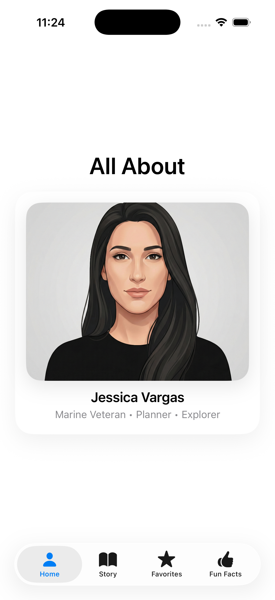
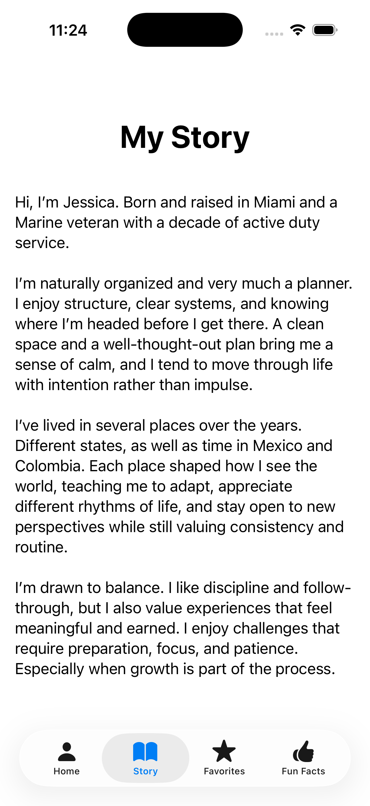
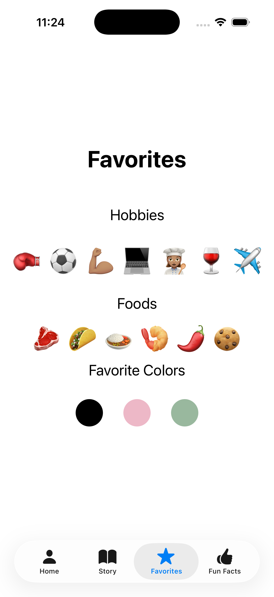
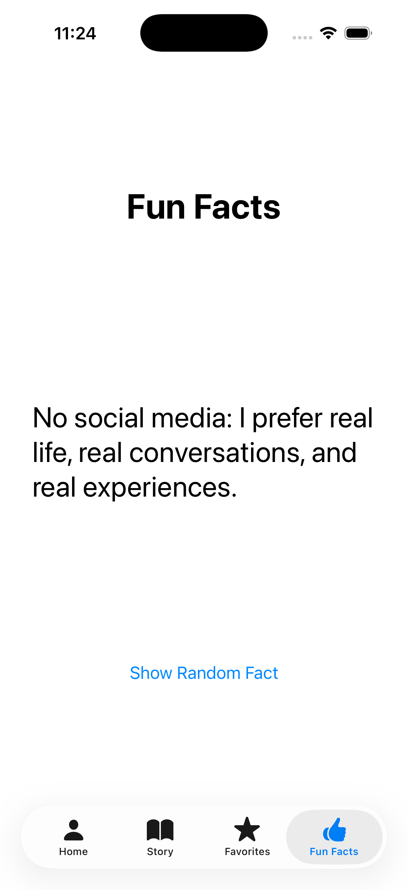

# iOS About Me

A personal SwiftUI profile app designed to present identity, story, interests, and personality through a clean multi-screen mobile interface.

## Overview

This project was built as part of my iOS development portfolio to demonstrate content-driven app design in SwiftUI. Instead of focusing on utilities or analytics, this app highlights how SwiftUI can be used to create a more personal and structured experience with navigation, profile presentation, storytelling, and interactive content sections.

## Features

- Home/profile screen
- Story section with personalized background content
- Favorites screen with hobbies, foods, and colors
- Fun facts screen with interactive random fact display
- Clean bottom-tab style navigation
- Personalized SwiftUI layout and content structure

## Built With

- Swift
- SwiftUI
- Xcode

## Screenshots

### Home Screen
Shows the main profile card and high-level introduction screen.

### Story Screen
Shows the personal story section with longer-form written content.

### Favorites Screen
Highlights hobbies, foods, and favorite colors in a more visual layout.

### Fun Facts Screen
Shows the fun-facts section with a simple interactive prompt for displaying random facts.

## What This Project Demonstrates

- SwiftUI navigation structure
- Content-driven app design
- Personalized mobile UI
- Multi-screen layout organization
- Visual presentation of profile data
- Simple interactive elements

## Why I Built It

I wanted to build a SwiftUI app that felt personal while still being structured and polished. This project gave me a chance to practice navigation, screen organization, custom content presentation, and the design of a profile-style mobile experience.

## Status

Completed as a portfolio iOS project.

## Author

**Jessica Vargas**  
Data Analytics Student | App Developer 
